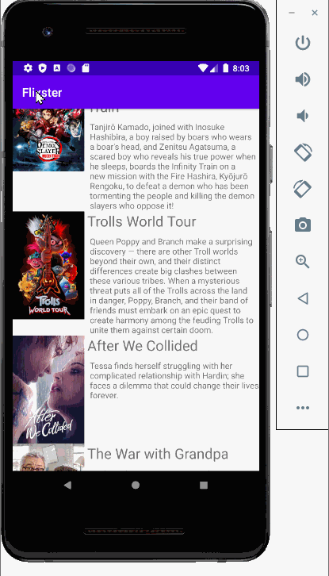

*Movie Android Application*

**Flixster(Name of the App)** Created a movie android application using Java and JSON to display current movies playing at the theaters along with a summary.

Submitted by: **Vanessa Hernandez**

## User can perferm the following

The following **required** functionality is completed:

* [x] User can **view a list of movies**
    

## Video Walkthrough

Here's a walkthrough of the App:

GIF created with [LiceCap](http://www.cockos.com/licecap/).

## Notes

Using an updated version of android studio requires updated libraries to import.

## License

    Copyright [2020] [Vanessa Hernandez]

    Licensed under the Apache License, Version 2.0 (the "License");
    you may not use this file except in compliance with the License.
    You may obtain a copy of the License at

        http://www.apache.org/licenses/LICENSE-2.0

    Unless required by applicable law or agreed to in writing, software
    distributed under the License is distributed on an "AS IS" BASIS,
    WITHOUT WARRANTIES OR CONDITIONS OF ANY KIND, either express or implied.
    See the License for the specific language governing permissions and
    limitations under the License.
